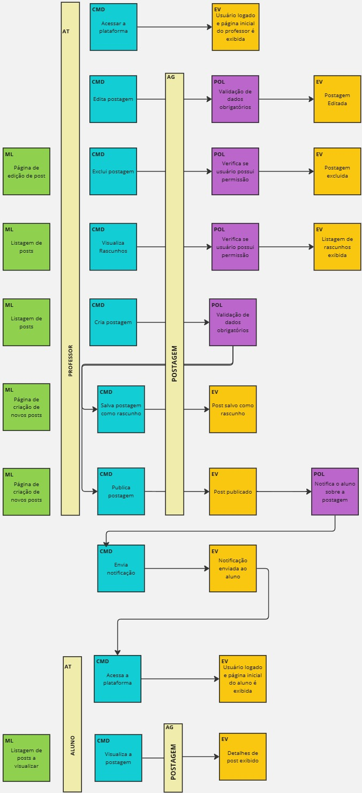
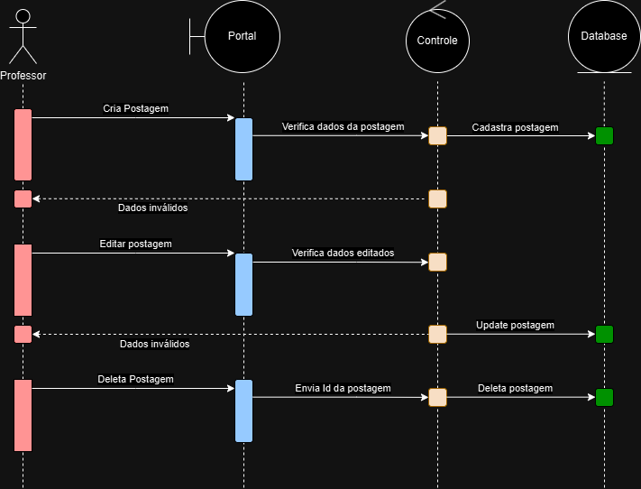
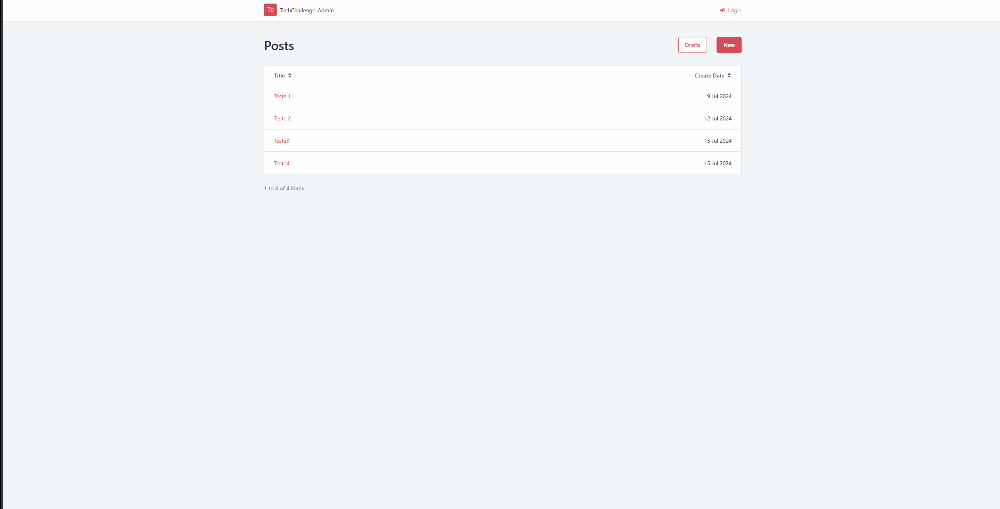
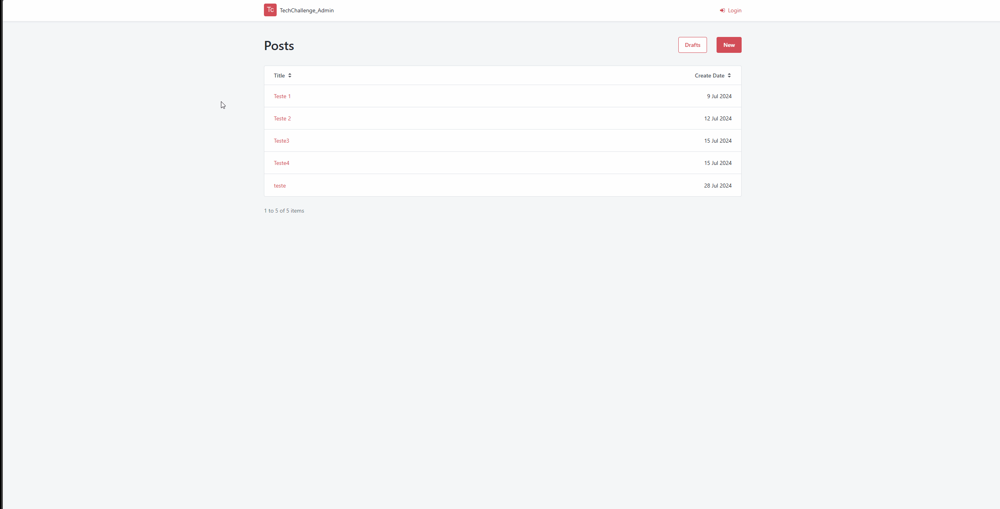
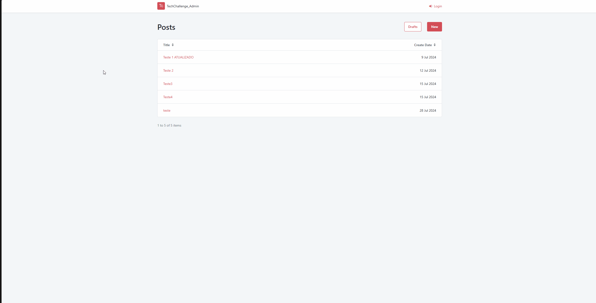
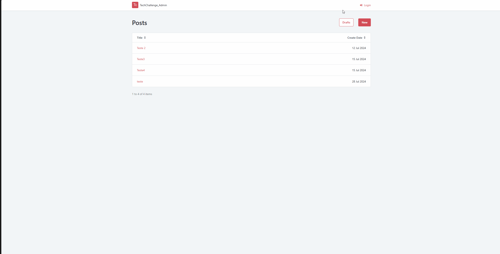
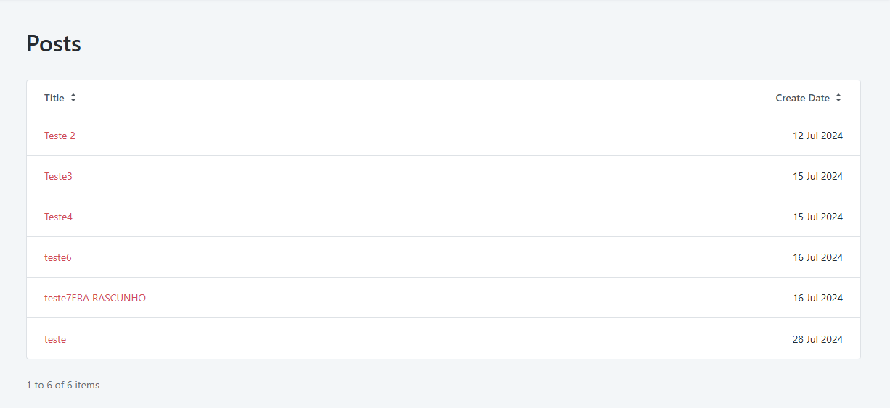
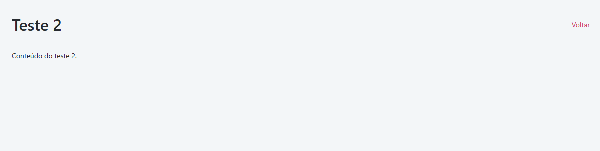

<h1>TECH-CHALLENGE 1</h1>

# Integrantes
* Lorenzo - RM357527
* Vitor Henrique Laia Martins - RM357177
* Felipe Alves Amodio - RM357145
* Fernando Caixeta do Amaral - RM357887
* Ynara Resende - RM357404

# Problema
Uma escola da rede pública de educação não possui uma ferramenta para postagem e compartilhamento de conhecimento. Dessa forma, é necessário desenvolver um sistema para que os professores possam criar postagens e os alunos possam acessar esse conteúdo, respectivamente.

# Fluxo de desenvolvimento

Iniciamos o fluxo de desenvolvimento discutindo quais documentos iríamos criar para chegar a um consenso sobre como e o que seria feito. Baseados no que aprendemos nas aulas de DDD, optamos por criar um Event Storming para organizar nossas ideias e identificar o que deveria ser feito. Além disso, criamos um diagrama de sequência para entender como os objetos e componentes se integrariam para alcançar o resultado almejado, ajudando a compreender de forma detalhada o cenário descrito pelo problema.

# Event Storming

O Event Storming descreve o fluxo que pode ser seguido para o desenvolvimento do sistema. Ele aborda o CRUD que os professores irão realizar e a parte de leitura que somente os alunos terão acesso. Dessa forma, fica mais fácil identificar as ações que os atores irão realizar.

# Diagrama de sequência

O Diagrama de sequência, foi feito com base no CRUD que é realizado pelos professores. Dessa forma, é comteplado o fluxo de ações  que o professor irá realizar. Isso facilitou o trabalho de definição de nomes de rotas e criações de funções.

# Execução

Baseando-se nos requisitos técnicos estabelecidos pela ativadade, que requiriu o uso da platoforma OutSystems, desenvolvemos 3 modulos. Um backend para realizar as operações necessárias e dois frontends um para o administrador (Professor) e outro para os alunos conseguirem acessar.

# Backend

O backend possui uma tabela de posts que armazena os posts criados pelos professores. Sua estrutura é a seguinte:

<table>
    <tr>
        <th>Id</th>
    </tr>
    <tr>
        <th>Title</th>
    </tr> 
    <tr>
        <th>Content</th>
    </tr> 
    <tr>
        <th>CreateDate</th>
    </tr> 
    <tr>
        <th>ModifyDate</th>
    </tr> 
    <tr>
        <th>IsDraft</th>
    </tr> 
</table>

Após criar a tabela, optamos por trabalhar com uma API do tipo REST para permitir que qualquer frontend possa ser integrado com nosso serviço. Com isso, criamos os controllers responsáveis por realizar as operações necessárias no banco de dados.

<h4>Controllers</h4>
<h5>Rotas para operações de CRUD posts</h5>

URL BASE: https://personal-wb3amgnv.outsystemscloud.com/TechChallenge_Backend/rest/v1

Através da URL base é possível conferir a documentação dos endpoints disponíveis. As ações possíveis são:

POST: {URL BASE}/posts

GET: {URL BASE}/posts

PUT: {URL BASE}/posts

GET: {URL BASE}/posts/{postId}

POST: {URL BASE}/posts/{postId}

Finalizado o back-end, iniciamos a construção do frontend.

# Frontend Admin

O frontend admin possui acesso a todas as operações de CRUD. Sendo assim, somente os professores (administradores) devem ter acesso a esse painel. Por meio dele, será possível criar postagens e controlar o que foi postado.

O usuário administrador consegue acessar o painel através da seguinte URL:

https://personal-wb3amgnv.outsystemscloud.com/TechChallenge_Admin/Posts

Nesse painel, o professor terá acesso às postagens e poderá realizar a criação das respectivas postagens.

Abaixo, irei listar como o administrador deve realizar as operações necessárias para o CRUD.

<h3>Criação de postagem: </h3>
<ol> 
<li>
    Acessar o painel e pressionar a opção "New"
</li>
<li>
    Adicionar um título e conteúdo para a postagem
</li>
<li>
    Clicar na opção publish ou save as draft(Rascunho)
</li>
</ol>

Ao realizar essa operação, será criada uma publicação ou salvo um rascunho, que não é exibido para os alunos.

Ex:

<h3>Atualização de postagem: </h3>
<ol> 
<li>
    Acessar o painel e clicar em uma postagem
</li>
<li>
    Alterar dados necessários nos inputs
</li>
<li>
    Clicar na opção Publish
</li>
</ol>

Após realizar essa operação, o post será atualizado e será exbido para os alunos.

Ex:

<h3>Exclusão de postagem: </h3>

<ol>
    <li>Acessar o painel e clicar em uma postagem.</li>
    <li>Clicar no botão Remove</li>
    <li>Um alerta será exibido solicitando confirmação; basta concordar</li>
    <li>Após aprovar, a postagem será excluída.</li>
</ol>

<h3>Acesso as postagens</h3>

Para ter acesso às postagens, basta acessar a URL informada no início das orientações do painel de administrador.

<h3>Área de rascunho</h3>

A área de rascunhos (Drafts) é um local onde são salvas postagens que foram iniciadas, mas não publicadas pelo usuário. Independentemente do motivo, o usuário pode acessar novamente essas postagens para continuar a edição ou publicá-las diretamente.

<ol>
    <li>Acesse o painel</li>
    <li>Clique na opção "Drafts".</li>
    <li>Nessa tela, serão listados os rascunhos. A partir desse ponto, o usuário pode acessar uma postagem, editar e publicar ou pressionar o botão "Publish" para publicar diretamente o rascunho.</li>
</ol>

# FrontEnd Alunos

O painel para os alunos é bem mais simples e limitado em comparação ao painel dos professores, abrangendo somente as operações de listagem de posts e acesso específico a um post.

O aluno pode acessar o painel através da seguinte URL:

https://personal-wb3amgnv.outsystemscloud.com/TechChallenge_Frontend/Posts

Ao acessar a URL, todas as postagens criadas pelos professores serão listadas.

Para o aluno acessar uma postagem, basta clicar em uma das postagens listadas. Ao clicar, o conteúdo da postagem será exibido.

Dessa forma, os alunos podem ter acesso ao conteúdo das postagens.